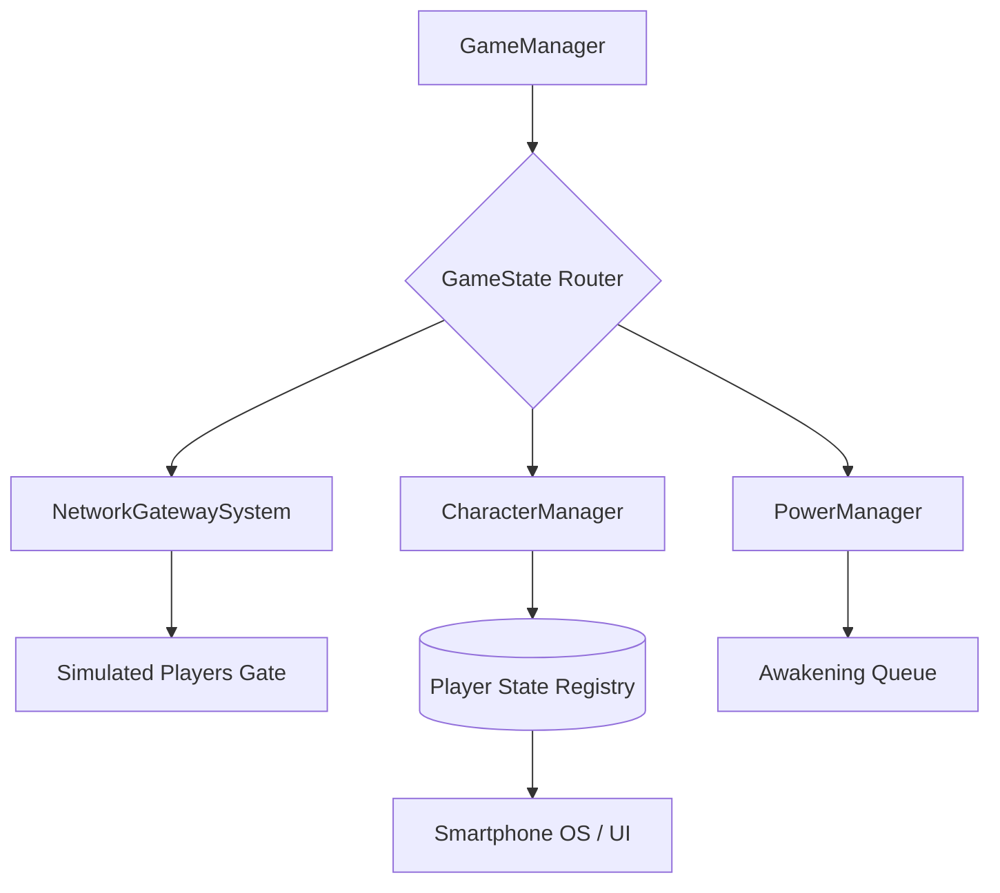

# 🗺️ Architecture Globale : CorruptionDuPortail

> [!NOTE]
> Ce document est la "Carte du Monde". Il définit la vision macroscopique et les flux vitaux du système.

## 🎯 Vision & Rôle
CorruptionDuPortail est un jeu multijoueur asymétrique (inspiré du Loup-Garou / Mafia) centré sur l'interaction sociale et la déduction. Le "Super Pouvoir" du projet réside dans son architecture **Gateway RPC**, permettant un debug massif en local (contrôle de bots/joueurs simulés par l'Host).

## 🏗️ Structure du Système

## 🔄 Flux de Données Principal
1. **Routage Gateway** : Toute action réseau (RPC) ciblant un joueur passe par `GetSafeRpcTarget`. Si l'ID est >= 100, l'Host l'intercepte.
2. **Identification Local** : Les systèmes utilisent `IsLocalOrSimulated` pour autoriser les actions sur l'Host lorsqu'il possède l'identité d'un robot.
3. **Persistance State Machine** : Le serveur dicte l'état (`GameState`) et déclenche les cinématiques/pouvoirs de manière asynchrone (UniTask).

## 🚥 État Global (Game Loop)
| État | Description | Transition Suivante |
| :--- | :--- | :--- |
| `Lobby` | Attente des joueurs & Readiness | `Intro` |
| `Introduction` | Attribution des Rôles & Factions | `Awakening` |
| `Awakening` | Phase de Nuit : Utilisation des pouvoirs | `Chaining` |
| `Chaining` | Révélations & Évènements Portal | `Vote` |
| `Vote` | Débat & Élimination | `Recap` |
| `Recap` | Bilan & Victoire | `GameEnding` |

## 🧩 Carte des Services (Wiki)
Accès rapide aux fonctionnalités détaillées :
- [ ] [Character System](features/character-system.md) : Gestion des identités et possession.
- [ ] [Network Gateway](features/network-gateway-system.md) : Le cœur du routage RPC simulé.
- [ ] [Smartphone OS](features/smartphone-os.md) : Simulation d'interface hub 2D.
- [ ] [Power System](features/power-system.md) : Architecture asymétrique des capacités.
- [ ] [Board System](features/board-system.md) : Rendu 3D et animations de cartes.
- [ ] [Audio System](features/audio-system.md) : Wrapper FMOD multijoueur.

## 📜 Conventions Techniques
- **Stack** : Unity (C#) + NGO (Netcode for GameObjects) + FMOD + UniTask.
- **Style** : Architecture Feature-based modulaire.
- **Sécurité** : Autorité Serveur stricte. Utilisation obligatoire de `IsLocalOrSimulated` pour le Debug.

---
> [!TIP]
> Garde ce document à jour après chaque changement de "haut niveau" pour éviter que l'IA ne perde de vue la vision globale.
