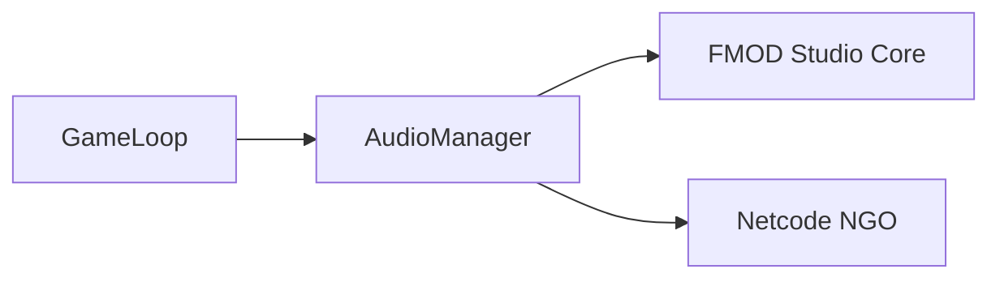

# 🛠️ Feature : Audio System

> [!IMPORTANT]
> **Rôle** : Wrapper RPC pour FMOD Studio. Gère le layering musical, les ambiances (Jour/Nuit) et les bruitages synchronisés en réseau.

## 🎬 Déclencheur (Point d'entrée)
- `PlayOneShotRpc` / `PlayBgmRpc` appelés par le serveur.
- Initialisation des instances d'ambiance lors du chargement de scène.

## 📦 Composants Clés
| Composant | Responsabilité |
| :--- | :--- |
| `GameAudioManager` | Singleton gérant les instances FMOD (`EventInstance`) et la réplication réseau. |
| `FMOD Studio` | Moteur audio externe piloté par le manager. |

## 💾 Données & État
- **Entrées** : `EventReference` (FMOD), Chemins de fichiers (String/FixedString).
- **Persistance** : Dictionnaires d'instances actives sur le client.
- **Sorties** : Rendu sonore spatialisé ou global.

## 🕸️ Couplage & Dépendances

## ⚠️ Points d'Attention & Risques
- [ ] **Gestion Mémoire** : Appel obligatoire à `Release()` après chaque `Stop()` pour éviter les fuites de mémoire C++ dans FMOD Core.
- [ ] **Sérialisation NGO** : Conversion obligatoire des `string` vers `FixedString128Bytes`/`64Bytes` pour les RPC (limite stricte de taille).

---
> [!SUCCESS]
> **Critères de Validation** : Une action déclenchée sur le serveur (ex: début de nuit) déclenche instantanément le changement de musique ou le bruitage sur tous les clients connectés.
