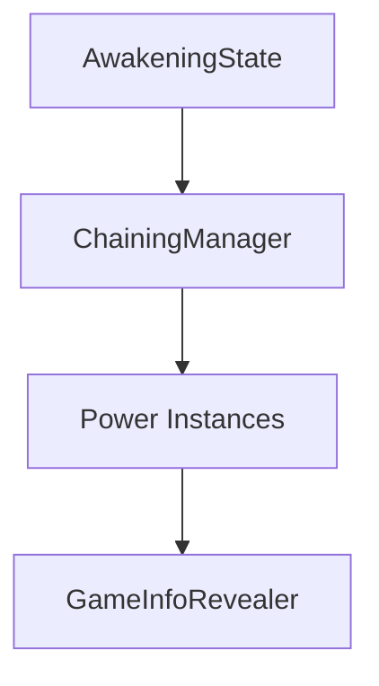

# 🛠️ Feature : Awakening System

> [!IMPORTANT]
> **Rôle** : Gère la phase nocturne synchronisée où les joueurs utilisent leurs pouvoirs de manière séquentielle ou parallèle via un système de file d'attente (`Chaining`).

## 🎬 Déclencheur (Point d'entrée)
- Transition du `GameManager` vers le `GameState` `Awakening`.
- Appel de `OnStartStateServer` côté serveur.

## 📦 Composants Clés
| Composant | Responsabilité |
| :--- | :--- |
| `AwakeningState` | Logique de phase (Timer, conditions de fin). |
| `ChainingManager` | Gère la mise en file d'attente des résolutions d'actions nocturnes. |
| `GameInfoRevealer` | Gère la publication des évènements (morts, enchaînements) suite à la phase. |

## 💾 Données & État
- **Entrées** : Intentions de pouvoirs envoyées par les clients (`Power.OnUsedServerRpc`).
- **Persistance** : État transitoire dans le `ChainingManager`.
- **Sorties** : Résultats des pouvoirs répercutés sur les `Character`.

## 🕸️ Couplage & Dépendances

## ⚠️ Points d'Attention & Risques
- [ ] **Architecture Scindée** : La mémoire court-terme est confiée au `ChainingManager` pour contourner le caractère éphémère des `GameStates`.
- [ ] **Garbage Collection** : Nécessité de vider (`Clear`) les listes du `ChainingManager` à chaque changement de phase majeure.

---
> [!SUCCESS]
> **Critères de Validation** : Tous les joueurs ayant un pouvoir nocturne ont pu agir, les actions ont été résolues dans l'ordre, et la partie passe à la phase `Chaining/TakeDownThePortal`.
