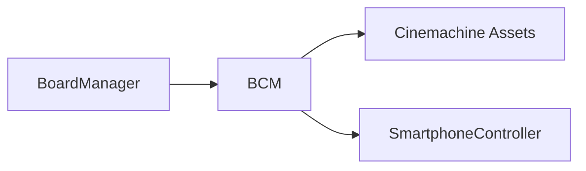

# 🛠️ Feature : Board Camera System

> [!IMPORTANT]
> **Rôle** : Orchestre les caméras virtuelles Cinemachine pour réagir aux menus, au smartphone et aux focus sur les joueurs avec des transitions fluides.

## 🎬 Déclencheur (Point d'entrée)
- `OnSmartphoneOpened` / `OnSmartphoneClosed`.
- Focus sur une carte de joueur via le `BoardManager`.

## 📦 Composants Clés
| Composant | Responsabilité |
| :--- | :--- |
| `BoardCameraManager` | Singleton supervisant les priorités des caméras virtuelles. |
| `CinemachineBrain` | Assure le fondu (Blend) et le damping entre les angles. |

## 💾 Données & État
- **Entrées** : Événements d'ouverture d'UI, sélection de cibles.
- **Persistance** : Valeurs de priorité (`Priority`) modifiées en temps réel sur les Virtual Cameras.
- **Sorties** : Changement d'angle de vue et de FOV.

## 🕸️ Couplage & Dépendances

## ⚠️ Points d'Attention & Risques
- [ ] **Presets Figés** : Toute nouvelle mise en scène (ex: vue élargie) nécessite la création d'un preset Cinemachine explicite pour ne pas briser la chorégraphie.
- [ ] **Damping** : Les transitions fluides dépendent des réglages de Damping dans l'inspecteur, sensibles aux changements brusques.

---
> [!SUCCESS]
> **Critères de Validation** : L'ouverture du smartphone déclenche une transition caméra fluide vers la vue hub, et sa fermeture ramène le focus sur le plateau de jeu.
