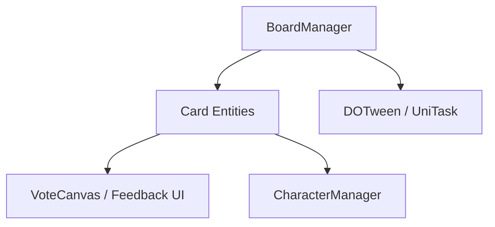

# 🛠️ Feature : Board & Card System

> [!IMPORTANT]
> **Rôle** : Représentation physique 3D/2D des joueurs dans la scène via des objets "Cartes" animés par DOTween et UniTask.

## 🎬 Déclencheur (Point d'entrée)
Événement `CharacterManager.onCharactersListUpdated` (instanciation des cartes lors de la connexion).

## 📦 Composants Clés
| Composant | Responsabilité |
| :--- | :--- |
| `BoardManager` | Singleton gérant le placement physique et l'alignement des cartes. |
| `Card` | Entité physique affichant les données du personnage et servant d'ancrage à l'UI. |
| `MeIconCard` | Feedback visuel "Moi" dynamique (lié au système d'identité). |

## 💾 Données & État
- **Entrées** : Liste des personnages du `CharacterManager`.
- **Persistance** : Liste locale `visibleCards`.
- **Sorties** : Objets physiques dans la scène Unity, état des `Canvas` de cartes.

## 🕸️ Couplage & Dépendances

## ⚠️ Points d'Attention & Risques
- [ ] **Gestion des Tweens** : Utilisation intensive de `CancellationTokenSource` pour éviter les conflits d'animation (Excellente pratique).
- [ ] **Hardcoding** : Espacement et overflow des cartes codés en dur (`Card_Spacing`), limité pour les très grandes parties.

---
> [!SUCCESS]
> **Critères de Validation** : Les cartes se placent automatiquement lors de l'arrivée des joueurs et se réorganisent fluidement par animation lors des phases de vote ou d'élimination.
