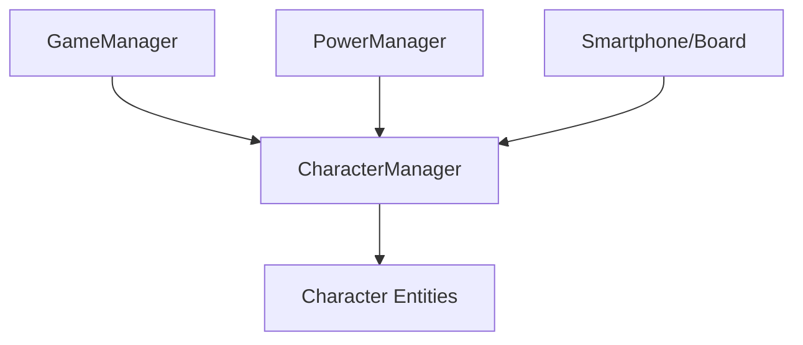

# 🛠️ Feature : Character System

> [!IMPORTANT]
> **Rôle** : Gère l'existence, les attributs et le cycle de vie de chaque participant (vrais joueurs, simulés, ou bots IA).

## 🎬 Déclencheur (Point d'entrée)
- `CharacterManager.AddNewCharacter()` lors de la connexion.
- Événements du `Lobby` ou injections de bots de debug.

## 📦 Composants Clés
| Composant | Responsabilité |
| :--- | :--- |
| `CharacterManager` | Singleton réseau maintenant la liste globale des participants et gérant l'abstraction d'identité. |
| `Character` | Entité synchronisée contenant le rôle, la faction, l'état de vie et le `ownerClientId`. |

## 💾 Données & État
- **Entrées** : Données de connexion, attributions de rôles du `GameManager`.
- **Persistance** : Liste dynamique `_characters` répliquée via Netcode.
- **Sorties** : Événement `onCharactersListUpdated`, état de vie/rôle pour les autres systèmes.

## 🕸️ Couplage & Dépendances

## ⚠️ Points d'Attention & Risques
- [ ] **Fragilité des IDs** : La génération d'IDs pour les *Fake Characters* (`FAKE_CLIENT_ID - N`) peut poser problème en cas de reconnexion ou migration d'Host.
- [ ] **Latence UI** : Utilisation de coroutines pour désynchroniser l'update UI du flux réseau afin d'éviter les surcharges.

---
> [!SUCCESS]
> **Critères de Validation** : Chaque joueur présent dans la partie possède une entité `Character` valide, accessible par son ID (réel ou virtuel), et ses changements d'état sont répercutés globalement.
