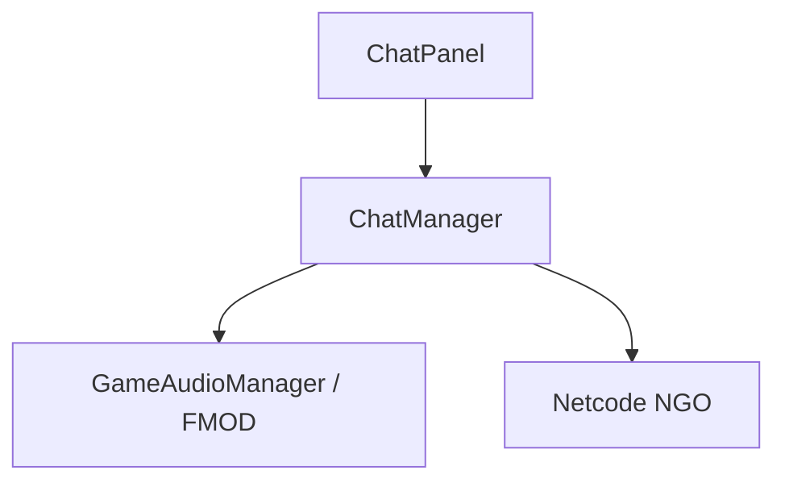

# 🛠️ Feature : Chat System

> [!IMPORTANT]
> **Rôle** : Système de messagerie multicanaux (Général, Serveur, Privé) avec retours sonores immersifs via FMOD.

## 🎬 Déclencheur (Point d'entrée)
- `DiscoverChatRpc` pour l'initialisation des canaux.
- `TrySendChatMessage` via l'UI `ChatPanel`.

## 📦 Composants Clés
| Composant | Responsabilité |
| :--- | :--- |
| `ChatManager` | Singleton gérant la liste des messages, les permissions de canaux et les RPC réseau. |
| `ChatWindow` | Structure de données locale stockant l'historique d'un canal spécifique. |
| `GameAudioManager` | (FMOD) Joue les sons de notification (`Discover`, `Message`) via des événements Studio. |

## 💾 Données & État
- **Entrées** : `SendChatMessageServerRpc` (String + ChannelID).
- **Persistance** : Listes `chatMessages` en mémoire (volatiles).
- **Sorties** : `ReceiveChatMessageRpc` vers les clients autorisés.

## 🕸️ Couplage & Dépendances

## ⚠️ Points d'Attention & Risques
- [ ] **Fuite Mémoire** : Pas de limite maximale documentée sur l'historique des messages (`List.Add` infini).
- [ ] **Sécurité** : `AllowTargetOverride = true` sur le client RPC pourrait être une faille si la validation serveur n'est pas imperméable.
- [ ] **Nettoyage Sonore** : Utilisation de lambdas pour FMOD difficiles à désabonner proprement.

---
> [!SUCCESS]
> **Critères de Validation** : Un message envoyé dans un canal spécifique arrive instantanément aux destinataires avec le feedback sonore approprié.
