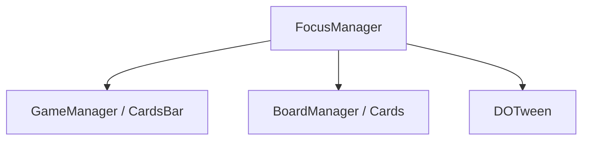

# 🛠️ Feature : Focus System

> [!IMPORTANT]
> **Rôle** : Fournit un feedback visuel dynamique (Auras de particules, Higgs-Z-Index) pour mettre en évidence les cibles valides d'un choix.

## 🎬 Déclencheur (Point d'entrée)
- `FocusManager.SetFocusOnType()` appelé par le `RoleTargetSystem`.
- Utilisation de lambdas de validation `Func<ulong, bool>`.

## 📦 Composants Clés
| Composant | Responsabilité |
| :--- | :--- |
| `FocusManager` | Singleton contrôlant l'opacité (Fade) et la hiérarchie de rendu (`sortingOrder`). |
| `FocusParticleUpdater` | S'attache dynamiquement aux objets pour générer une bordure de particules (`BoxEdge`). |
| `TransformFollower` | Assure que les particules suivent les mouvements des Canvas UI ou objets 3D. |

## 💾 Données & État
- **Entrées** : `TargetIncludeFlags`, prédicats de validation.
- **Persistance** : Liste `currentFocusObjects` mémorisant les objets focalisés pour nettoyage.
- **Sorties** : Augmentation du `sortingOrder` UI et activation des effets visuels.

## 🕸️ Couplage & Dépendances

## ⚠️ Points d'Attention & Risques
- [ ] **Bugs de Profondeur** : Modifie directement les `sortingOrder` des Canvas. S'il n'est pas nettoyé via `UnfocusAll`, les bugs de Z-Index persistent.
- [ ] **Nettoyage** : Nécessite un appel rigoureux à `UnfocusObject` pour supprimer les particules et réinitialiser le layer de rendu.

---
> [!SUCCESS]
> **Critères de Validation** : Lors d'un choix de cible, seuls les joueurs valides s'allument avec une bordure de particules, tandis que le reste de l'UI s'assombrit légèrement.
