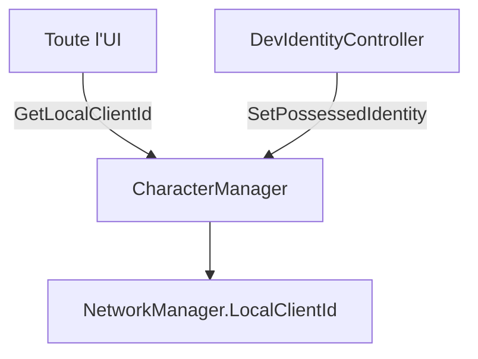

# 🛠️ Feature : Identity System (Possession)

> [!IMPORTANT]
> **Rôle** : Permet à un développeur (sur l'Host) de "posséder" l'identité locale d'un autre joueur pour tester l'UI et les interactions de son point de vue.

## 🎬 Déclencheur (Point d'entrée)
- Inputs clavier via `DevIdentityController.cs` (`F1-F4`).
- Appel à `CharacterManager.instance.SetPossessedIdentity(id)`.

## 📦 Composants Clés
| Composant | Responsabilité |
| :--- | :--- |
| `CharacterManager` | Point d'entrée unique `GetLocalClientId()` qui retourne l'ID possédé ou l'ID réel. |
| `DevIdentityController` | Capture les raccourcis clavier de debug pour cycler entre les joueurs. |
| `MeIconCard` | UI réactive qui se déplace selon l'identité possédée via l'événement `onLocalIdentityChanged`. |

## 💾 Données & État
- **Entrées** : Inputs clavier, listes de `Character` connectés.
- **Persistance** : Variable volatile `_debugPossessedId` (ulong?) dans le `CharacterManager`.
- **Sorties** : Événement `onLocalIdentityChanged`, changement du retour de `GetLocalClientId()`.

## 🕸️ Couplage & Dépendances

## ⚠️ Points d'Attention & Risques
- [ ] **Localité** : La possession est **purement locale/visuelle**. Elle n'affecte PAS l'autorité réseau (`IsOwner`) des objets.
- [ ] **Debug Only** : Ce système ne doit pas impacter les joueurs réels en build de production (conditionné par des IDs >= 100).

---
> [!SUCCESS]
> **Critères de Validation** : En pressant F2/F3, l'Interface (Smartphone, Cartes, etc.) affiche les données du joueur sélectionné et l'icône "Moi" se déplace correctement.
