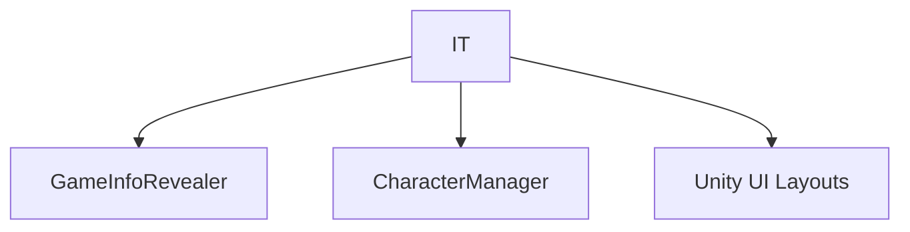

# 🛠️ Feature : Info Table System (Deduction)

> [!IMPORTANT]
> **Rôle** : Carnet de bord interactif permettant au joueur de traquer ses déductions. Inclut un moteur d'analyse de conflits logiques.

## 🎬 Déclencheur (Point d'entrée)
Ouverture de l'application dédiée dans le Smartphone.

## 📦 Composants Clés
| Composant | Responsabilité |
| :--- | :--- |
| `InfoTableSystem` | Manager gérant la construction de la grille et la détection globale des conflits. |
| `InfoRoleChecker` | Gère l'état d'une cellule (None, Sure, Not, Maybe). |
| `InfoTablePlayerRoleHandler` | Gère une ligne (joueur) et ses conflits locaux. |

## 💾 Données & État
- **Entrées** : `onCharacterInfoRevealedChanged` (S'abonne au serveur).
- **Persistance** : État local de la grille (Tableau de d'états de cellules).
- **Sorties** : Alertes visuelles de conflits (`PlayerMultipleRoles`, `RoleOverCapacity`).

## 🕸️ Couplage & Dépendances

## ⚠️ Points d'Attention & Risques
- [ ] **Verrouillage** : Une fois un rôle révélé par le serveur, la ligne est **verrouillée** et ne peut plus être modifiée par le joueur (cohérence stricte).
- [ ] **Performance** : Reconstruction complète de la grille à chaque démarrage de partie via `Clean()` / `BuildGameUi()`.

---
> [!SUCCESS]
> **Critères de Validation** : Si le joueur marque deux personnes différentes comme étant "Sûres" pour le même rôle unique, le système affiche immédiatement un conflit visuel.
