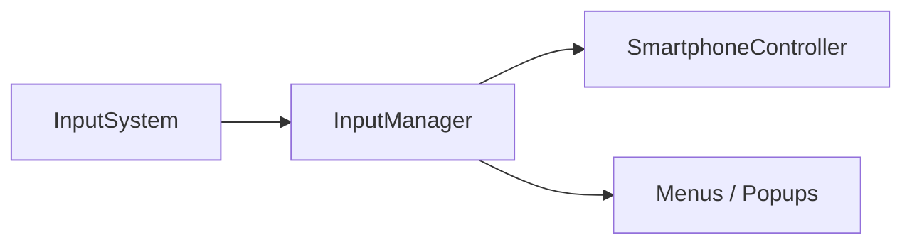

# 🛠️ Feature : Input & Action Stack

> [!IMPORTANT]
> **Rôle** : Middleware entre l'Input System natif de Unity et la logique métier. Gère une pile de priorité pour les annulations (Escape Button).

## 🎬 Déclencheur (Point d'entrée)
Callbacks natifs du Unity Input System (`InputAction.CallbackContext`).

## 📦 Composants Clés
| Composant | Responsabilité |
| :--- | :--- |
| `InputManager` | Singleton central collectant les enregistrements d'actions (`RegisterAction`). |
| `ActionStack` | Pile LIFO gérant la priorité du bouton Escape (seule l'UI active du dessus réagit). |

## 💾 Données & État
- **Entrées** : Mapping touches clavier / boutons manettes.
- **Persistance** : Dictionnaires d'événements C# et pile `onEscapePressedStack`.
- **Sorties** : Déclenchement d'événements logiques (`OnCancel`, `OnConfirm`, etc.).

## 🕸️ Couplage & Dépendances

## ⚠️ Points d'Attention & Risques
- [ ] **Fuite de Mémoire** : Nécessite des `UnregisterAction` rigoureux à la destruction des composants pour éviter de saturer la pile avec des handlers morts.
- [ ] **Isolement Local** : Fonctionne purement côté client. Aucun couplage direct avec l'autorité réseau.

---
> [!SUCCESS]
> **Critères de Validation** : L'appui sur Escape ferme l'application Smartphone active sans fermer le téléphone lui-même (sauf si c'était le dernier élément de la pile).
