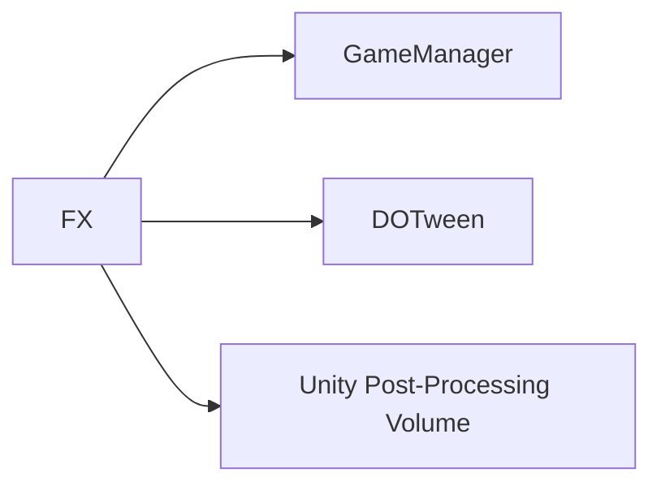

# 🛠️ Feature : Light & FX System

> [!IMPORTANT]
> **Rôle** : Pilote l'ambiance visuelle (Lumières, Post-FX, Particules) en réaction aux phases de jeu (Jour, Nuit, Corruption).

## 🎬 Déclencheur (Point d'entrée)
Événements du `GameManager` (`onStateStart`, `onDayPassed`).

## 📦 Composants Clés
| Composant | Responsabilité |
| :--- | :--- |
| `LightManager` | Gère les Global Lights et le Post-Processing (Color Grading, Brume). |
| `CardEffectManager` | Injecte des effets visuels locaux sur les cartes ciblées (Corruption). |

## 💾 Données & État
- **Entrées** : État actuel du jeu, transition de jour.
- **Persistance** : Paramètres de teintes animés via DOTween (`Lerp`).
- **Sorties** : Rendu visuel de la salle et des entités de jeu.

## 🕸️ Couplage & Dépendances

## ⚠️ Points d'Attention & Risques
- [ ] **Performance Visuelle** : Impact sur le Fill-rate des shaders (brume/vignettage).
- [ ] **Interruption** : Nécessite des `DOKill()` sur les transitions lumineuses si le serveur saute des phases prématurément.

---
> [!SUCCESS]
> **Critères de Validation** : Le passage à la phase de nuit s'accompagne d'un assombrissement global et d'un changement de teinte chromatique fluide.
