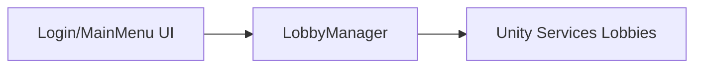

# 🛠️ Feature : Lobby System

> [!IMPORTANT]
> **Rôle** : Gère l'interfaçage avec *Unity Services Lobbies* pour le matchmaking, la création de groupe et le maintien de la session pré-jeu.

## 🎬 Déclencheur (Point d'entrée)
Appels asynchrones (`CreateLobby`, `JoinLobby`) depuis les menus `LoginMenu` ou `MainMenu`.

## 📦 Composants Clés
| Composant | Responsabilité |
| :--- | :--- |
| `LobbyManager` | Singleton persistant encapsulant l'API Unity Services Lobbies. |
| `Unity Services` | Infrastructure cloud externe gérant les métadonnées de session. |

## 💾 Données & État
- **Entrées** : Nom du lobby, paramètres de jeu, code de jointure.
- **Persistance** : État synchronisé côté infrastructure Unity. Heartbeat local (15s).
- **Sorties** : Événements `OnLobbyCreated`, `OnLobbyUpdated`.

## 🕸️ Couplage & Dépendances

## ⚠️ Points d'Attention & Risques
- [ ] **Heartbeat Vital** : Si le script est désactivé ou le Token annulé, le lobby s'efface de l'infrastructure après ~30s.
- [ ] **Polling** : Sondage récurrent (5.1s) pour tenir l'UI à jour, peut être source de latence si le réseau est instable.

---
> [!SUCCESS]
> **Critères de Validation** : Un joueur peut créer un lobby, obtenir un code, et un second joueur peut rejoindre ce lobby via le code, les deux voyant leurs listes d'attente synchronisées.
