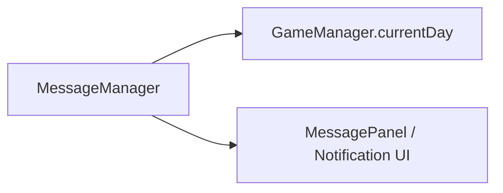

# 🛠️ Feature : Message System

> [!IMPORTANT]
> **Rôle** : Gère le stockage et la révélation asynchrone ("Broadcasting") de notifications publiques à la fin de chaque cycle de "Jour".

## 🎬 Déclencheur (Point d'entrée)
- `SendMessageRpc` : Empile un message caché sur le serveur.
- `RevealAllMessage()` : Libère tous les messages en attente pour affichage public (appelé par la State Machine).

## 📦 Composants Clés
| Composant | Responsabilité |
| :--- | :--- |
| `MessageManager` | Singleton gérant les deux listes de messages (Cachée vs Révélée). |
| `MessageInfo` | Struct synchronisée NGO contenant le contenu (`FixedString512Bytes`) et les métadonnées. |

## 💾 Données & État
- **Entrées** : Contenu texte, ID de l'expéditeur, Jour actuel.
- **Persistance** : Deux `NetworkList<MessageInfo>` synchronisées.
- **Sorties** : Événement `OnListChanged` sur les clients lors de la révélation.

## 🕸️ Couplage & Dépendances

## ⚠️ Points d'Attention & Risques
- [ ] **Limite de Taille** : Utilise `FixedString512Bytes` (NGO). Les messages dépassant 512 bytes seront tronqués ou causeront des erreurs de sérialisation.
- [ ] **Visibilité Technique** : Bien que `messagesToReveal` soit une NetworkList (accessible techniquement), elle est logiquement ignorée par l'UI jusqu'à son transfert dans `revealedMessages`.

---
> [!SUCCESS]
> **Critères de Validation** : Un message envoyé "en secret" durant le jour n'apparaît dans le journal public qu'au moment de la transition de phase déclenchée par le serveur.
