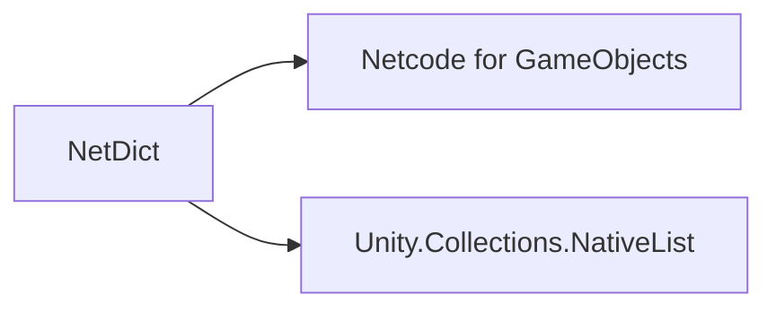

# 🛠️ Feature : Network Dictionary

> [!IMPORTANT]
> **Rôle** : Surcouche utilitaire bas-niveau comblant l'absence native de dictionnaires synchronisés dans Unity NGO.

## 🎬 Déclencheur (Point d'entrée)
Initialisation et manipulation côté Serveur via les méthodes `Add`, `Remove`, `Reset`.

## 📦 Composants Clés
| Composant | Responsabilité |
| :--- | :--- |
| `NetworkDictionary<K, V>` | Hérite de `NetworkVariableBase`. Gère la sérialisation Delta (`WriteDelta`/`ReadDelta`). |
| `NetworkDictionaryEvent` | Structure interne notifiant le type d'opération (Add, Remove, Reset) pour optimiser la bande passante. |

## 💾 Données & État
- **Entrées** : Clés et Valeurs `unmanaged` (blittables).
- **Persistance** : `NativeList` (Allocation native).
- **Sorties** : Synchronisation automatique des deltas vers tous les clients.

## 🕸️ Couplage & Dépendances

## ⚠️ Points d'Attention & Risques
- [ ] **Contrainte de Typage** : Les types `TKey` et `TValue` doivent être **unmanaged** (blittable). Pas de classes managées.
- [ ] **Gestion Mémoire** : Nécessite un appel à `Dispose()` pour éviter les fuites de mémoire native.
- [ ] **Unicité** : L'ajout d'une clé déjà présente lève une exception immédiate.

---
> [!SUCCESS]
> **Critères de Validation** : Une donnée ajoutée au dictionnaire sur le serveur est accessible sur tous les clients après synchronisation du buffer.
