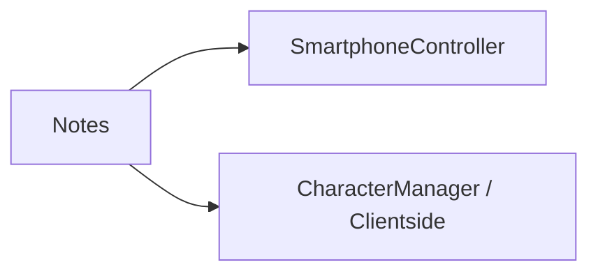

# 🛠️ Feature : Note System

> [!IMPORTANT]
> **Rôle** : Application diégétique permettant au joueur de conserver des traces écrites et visuelles de ses déductions.

## 🎬 Déclencheur (Point d'entrée)
Ouverture de l'application via le `SmartphoneController`.

## 📦 Composants Clés
| Composant | Responsabilité |
| :--- | :--- |
| `NoteManager` | Logique d'enregistrement et d'historisation des notes locales. |
| `NoteChoosePanel` | UI permettant d'affecter une note ou une couleur à un joueur spécifique. |

## 💾 Données & État
- **Entrées** : Saisie texte, sélections de couleurs/icônes.
- **Persistance** : Données purement client-side (non synchronisées sur le réseau).
- **Sorties** : Sauvegarde locale (Prefs ou Fichier selon l'implémentation).

## 🕸️ Couplage & Dépendances

## ⚠️ Points d'Attention & Risques
- [ ] **Isolement** : Ce système n'affecte PAS la logique de jeu réelle (GameLogic). C'est uniquement un outil de confort pour le joueur.
- [ ] **Clarification** : Pas de synchronisation réseau prévue (secret des notes).

---
> [!SUCCESS]
> **Critères de Validation** : Le joueur peut écrire une note sur un adversaire, fermer l'application, et retrouver l'information intacte plus tard.
