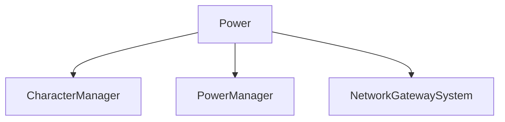

# 🛠️ Feature : Power System

> [!IMPORTANT]
> **Rôle** : Incarne la logique asymétrique du jeu. Gère l'attribution, le ciblage et l'exécution asynchrone des capacités.

## 🎬 Déclencheur (Point d'entrée)
- **Instanciation** : `PowerManager.GivePowerToCharacter()`.
- **Exécution** : Requête client vers `OnPowerUsedServer`.

## 📦 Composants Clés
| Composant | Responsabilité |
| :--- | :--- |
| `PowerManager` | Singleton gérant le cycle de vie, les instances et les références réseau des pouvoirs. |
| `Power` | Classe de base (POO) isolant le flux `ServerRpc` / `ClientRpc` pour éviter les boucles infinies. |

## 💾 Données & État
- **Entrées** : `ownerClientId`, cibles du pouvoir.
- **Persistance** : Instance vivante rattachée à un `Character`.
- **Sorties** : Effets de jeu (révélations, éliminations, modifications d'états).

## 🕸️ Couplage & Dépendances

## ⚠️ Points d'Attention & Risques
- [ ] **Stack Overflow Prevention** : Ne jamais appeler une méthode RPC qui boucle sur le déclencheur original sans passer par le switch Server/Client dédié (crucial pour l'Host possédant des bots).
- [ ] **Routage Gateway** : Interdiction d'utiliser `RpcTarget.Single(clientId)` directement si le pouvoir peut appartenir à un bot (ID >= 100). Utiliser `GetSafeRpcTarget`.

---
> [!SUCCESS]
> **Critères de Validation** : Un pouvoir activé par un joueur (humain ou simulé) exécute sa logique serveur de manière sécurisée et ses retours visuels clients de manière coordonnée.
