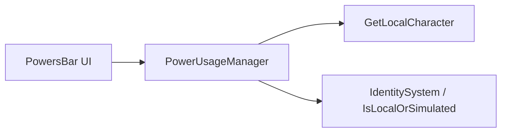

# 🛠️ Feature : Power Usage System

> [!IMPORTANT]
> **Rôle** : Gère la machine à états locale et la validation de l'utilisation d'un pouvoir depuis l'interface client (clics UI).

## 🎬 Déclencheur (Point d'entrée)
Clic sur une capacité dans la `powersBar` (déclenchant `OnPowerClicked`).

## 📦 Composants Clés
| Composant | Responsabilité |
| :--- | :--- |
| `PowerUsageManager` | Contrôleur local validant le droit d'utiliser le pouvoir et gérant le ciblage. |
| `Power` (instances) | Implémentent `CanUse()`, `StartUse()`, et `UsingPowerUpdate()`. |

## 💾 Données & État
- **Entrées** : Clics UI, Position de souris (pour ciblage).
- **Persistance** : Variable `currentPower` memorisant le pouvoir "équipé".
- **Sorties** : Déclenchement de la phase de ciblage ou exécution directe.

## 🕸️ Couplage & Dépendances

## ⚠️ Points d'Attention & Risques
- [ ] **Reset d'État** : Nécessité d'une annulation explicite (`Cancel()`) pour nettoyer les focus UI et particules si le joueur change de pouvoir.
- [ ] **Dette** : Risque de blocage UI si une classe Power héritée n'implémente pas correctement le nettoyage dans sa surcharge de `Cancel()`.

---
> [!SUCCESS]
> **Critères de Validation** : Un clic sur un pouvoir l'active visuellement, permet de sélectionner une cible si nécessaire, et un second clic ou un clic droit annule proprement l'action sans laisser de résidus visuels.
