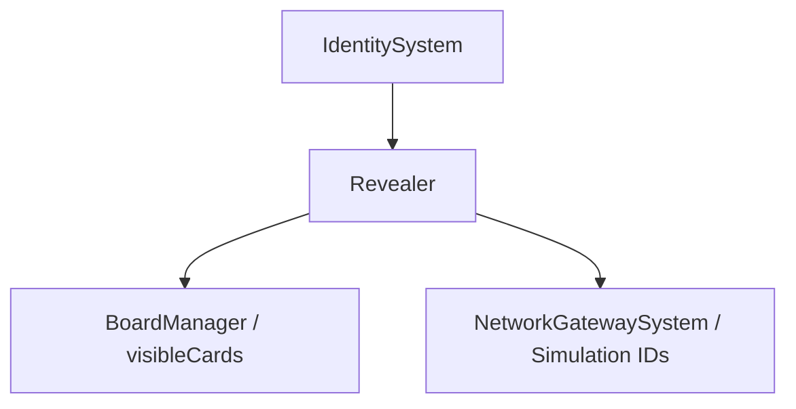

# 🛠️ Feature : Reveal Info System (Game Info Revealer)

> [!IMPORTANT]
> **Rôle** : Arbitre du "brouillard de guerre" asymétrique. Gère quelles informations secrètes (Rôles, Faction) sont visibles par quel client ou publiquement.

## 🎬 Déclencheur (Point d'entrée)
- `RoleAttributionState` (Initialisation).
- Événements de mort ou Pouvoirs de révélation via `SetRevealLevel`.

## 📦 Composants Clés
| Composant | Responsabilité |
| :--- | :--- |
| `GameInfoRevealer` | Manager centralisant les dictionnaires de révélation et gérant la synchronisation. |
| `CharacterInfoReveal` | Structure de données pour le tracking individuel des révélations. |
| `RevealLevel` | Énumérateur (False, Personal, Public) définissant la portée de l'info. |

## 💾 Données & État
- **Entrées** : `SetRevealLevelRpc`, `SetRevealLevelSimulatedRpc`.
- **Persistance** : Dictionnaire `charactersInfoRevealed` (Synchronisé) et `simulationsKnowledge` (Host-only).
- **Sorties** : Mise à jour visuelle des cartes (via `BoardManager`).

## 🕸️ Couplage & Dépendances

## ⚠️ Points d'Attention & Risques
- [ ] **Dépendance Front-end** : La révélation visuelle (retournement de carte) est hard-codée via des chaînes de caractères ("isRoleRevealed") utilisant la réflexion. 
- [ ] **Complexité de Simulation** : Les révélations destinées aux bots (IDs >= 100) nécessitent un routage spécifique via l'Host pour être persistantes lors d'un switch d'identité.

---
> [!SUCCESS]
> **Critères de Validation** : Un rôle révélé "Publiquement" est visible sur toutes les cartes des clients. Un rôle révélé "Personnellement" n'est visible que par l'Host possédante cette identité.
