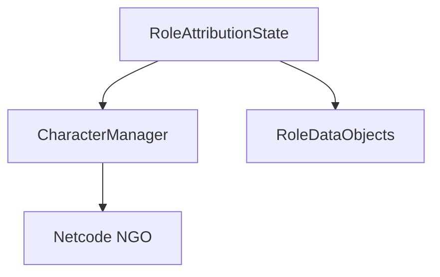

# 🛠️ Feature : Role Distribution

> [!IMPORTANT]
> **Rôle** : Assigne aléatoirement des instances de `RoleDataObject` aux joueurs et bots au début de la partie.

## 🎬 Déclencheur (Point d'entrée)
`RoleAttributionState.OnStartStateServer` (Serveur uniquement).

## 📦 Composants Clés
| Composant | Responsabilité |
| :--- | :--- |
| `RoleAttributionState` | Gère le tirage aléatoire et les quotas via le `roleAttributionDictionary`. |
| `RoleDataObject` | ScriptableObject contenant les données statiques et les pouvoirs liés au rôle. |
| `CharacterManager` | Synchronise le rôle assigné sur chaque entité `Character`. |

## 💾 Données & État
- **Entrées** : Configuration `roleAttributionDictionary` (quotas, types).
- **Persistance** : Propriété `role` sur l'objet `Character` (synchronisée NGO).
- **Sorties** : Attribution globale des rôles et instanciation des pouvoirs.

## 🕸️ Couplage & Dépendances

## ⚠️ Points d'Attention & Risques
- [ ] **Engorgement Réseau** : L'attribution massive de rôles et de pouvoirs via RPC peut saturer le buffer au démarrage.
- [ ] **Latence NGO** : Présence de `WaitAndNextState` (WaitForSeconds) codés en dur pour compenser les délais de synchronisation.
- [ ] **Memory Management** : Utilisation de `Clone()` sur des ScriptableObjects nécessitant une gestion propre du cycle de vie.

---
> [!SUCCESS]
> **Critères de Validation** : Chaque joueur reçoit son rôle, a accès à ses pouvoirs, et l'information est correctement répliquée (en tenant compte du secret/révélation).
