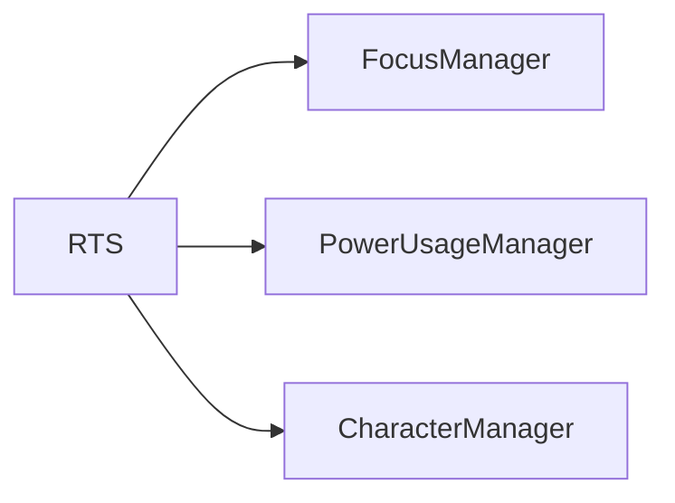

# 🛠️ Feature : Role Target System

> [!IMPORTANT]
> **Rôle** : Pont entre la logique de pouvoir et l'UI. Gère l'activation des filtres de sélection de cible (`Focus`) et la transmission des choix du joueur vers le réseau.

## 🎬 Déclencheur (Point d'entrée)
`PowerUsageManager` lorsqu'un pouvoir nécessitant un ciblage est activé.

## 📦 Composants Clés
| Composant | Responsabilité |
| :--- | :--- |
| `RoleTargetSystem` | Gère la machine à états du ciblage local (Click on target). |
| `FocusManager` | Appelé par ce système pour allumer visuellement les cibles valides. |
| `TargetIncludeFlags` | Filtres binaires (Self, Others, Dead, Alive) pour la pré-validation des cibles. |

## 💾 Données & État
- **Entrées** : `TargetIncludeFlags`, Prédicat de validation (Lambda).
- **Persistance** : Variable `currentTarget` lors de la sélection.
- **Sorties** : ID du joueur sélectionné transmis au pouvoir (`OnPowerUsedServer`).

## 🕸️ Couplage & Dépendances

## ⚠️ Points d'Attention & Risques
- [ ] **Complexité de Validation** : Les filtres peuvent être combinés avec des lambdas personnalisées, rendant le debug du ciblage parfois complexe.
- [ ] **Feedback UI** : Dépendance forte au `FocusManager` pour le retour visuel.

---
> [!SUCCESS]
> **Critères de Validation** : En activant un pouvoir de ciblage, seules les cibles répondant aux critères s'allument (Focus), et un clic sur l'une d'elles valide l'action et ferme le mode ciblage.
