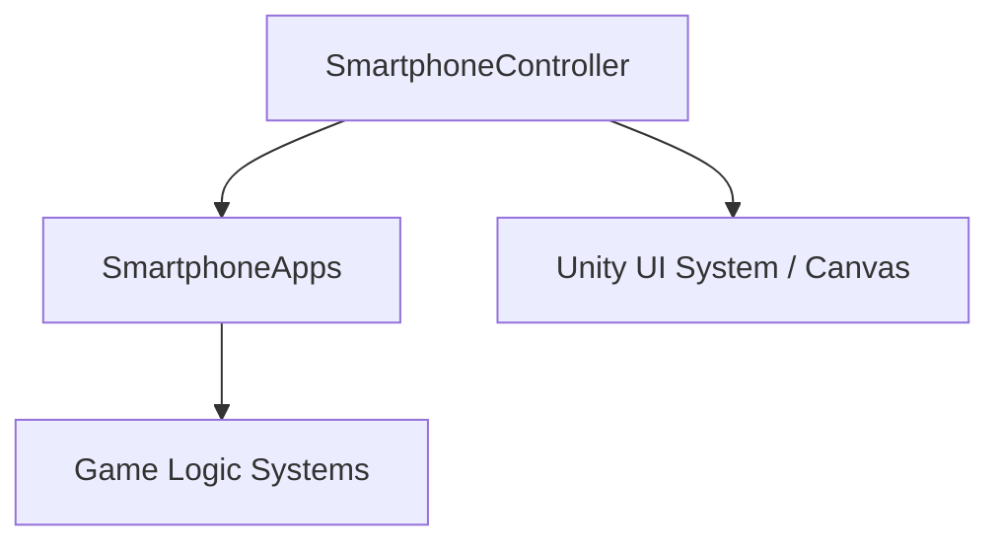

# 🛠️ Feature : Smartphone OS

> [!IMPORTANT]
> **Rôle** : Outil auxiliaire d'interaction (hub 2D) du joueur. Simule un OS avec système d'applications (Notes, Chat) pour supporter la déduction.

## 🎬 Déclencheur (Point d'entrée)
- Input utilisateur via `SmartphoneController`.
- Clic sur le bouton physique du smartphone dans la scène ou raccourci clavier.

## 📦 Composants Clés
| Composant | Responsabilité |
| :--- | :--- |
| `SmartphoneController` | Gère la machine à états de navigation, les transitions d'applications et le rendu du Canvas. |
| `SmartphoneApp` | Classe de base pour toutes les applications (Note, Chat, Map, etc.). |
| `SwipeUX` | Module gérant l'interaction tactile/souris pour le défilement et la fermeture d'apps. |

## 💾 Données & État
- **Entrées** : Pointer Events (Unity UI), Raccourcis clavier.
- **Persistance** : État de l'application active et pile de navigation en mémoire locale.
- **Sorties** : Rendu visuel plein écran (ou overlay selon l'état).

## 🕸️ Couplage & Dépendances

## ⚠️ Points d'Attention & Risques
- [ ] **Boucle Infinie** : Risque de crash lors du polling récursif sur `GetNeighborApp` si la grille d'apps est mal configurée (cycle fermé).
- [ ] **Performance UI** : Nombre important de GameObjects actifs en arrière-plan. Nécessité d'une gestion rigoureuse des `SetGameObjectActive`.

---
> [!SUCCESS]
> **Critères de Validation** : Le joueur peut ouvrir son téléphone, naviguer d'une application à l'autre sans lag, et fermer le téléphone pour revenir à la vue du plateau.
