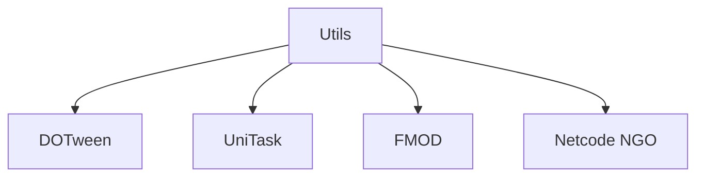

# 🛠️ Feature : Technical Utilities & Extensions

> [!IMPORTANT]
> **Rôle** : Boîte à outils transverse fournissant des Helpers C#, des extensions d'UI et des attributs personnalisés pour l'inspecteur Unity.

## 📦 Composants Clés

### 🧩 Extensions C#
| Domaine | Extension | Responsabilité |
| :--- | :--- | :--- |
| **UI** | `CanvasGroupExtensions` | Animations unifiées `DoShowGroup` / `DoHideGroup` via DOTween. |
| **Netcode** | `NetworkObjectExtensions` | Facilitation du cycle de vie des objets NGO. |
| **Audio** | `FmodEventExtensions` | Lecture directe de sons FMOD depuis une `EventReference`. |

### 🛠️ Outils Inspecteur
| Attribut | Usage |
| :--- | :--- |
| `[Polymorphic]` | Permet de choisir une classe dérivée (ex: `Power`) directement dans l'inspecteur via un menu. |
| `[AddressableEnums]` | Facilite le mappage des ressources adressables. |

## 💾 Données & État
- **Entrées** : Types génériques, Références d'événements, Données de l'Inspecteur.
- **Sorties** : Actions simplifiées, Rendu ergonomique de l'inspecteur.

## 🕸️ Couplage & Dépendances

## ⚠️ Points d'Attention & Risques
- [ ] **DOTween Kill** : Les extensions UI appellent systématiquement `DOKill(true)` pour éviter les conflits d'animation.
- [ ] **UniTask** : Conception "Awaitable" pour une intégration fluide dans les séquenceurs asynchrones.
- [ ] **Conventions** : Préfixes `Do...` pour les animations et `Get...` pour la résolution de données.

---
> [!SUCCESS]
> **Critères de Validation** : Les outils sont accessibles globalement dans le projet sans erreurs de compilation et simplifient l'écriture de la logique métier.
