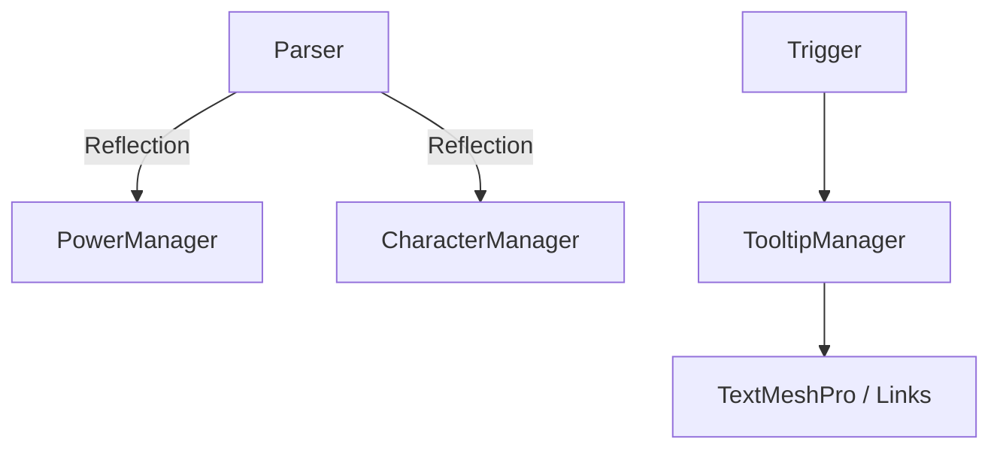

# 🛠️ Feature : Tooltip System

> [!IMPORTANT]
> **Rôle** : Moteur de fenêtres informatives dynamiques avec support de liens hyper-textes imbriqués et parsing de variables par réflexion.

## 🎬 Déclencheur (Point d'entrée)
- Survol d'un objet implémentant `ITooltipTrigger`.
- `TooltipManager.CreateNewTooltipFromGameObject()`.

## 📦 Composants Clés
| Composant | Responsabilité |
| :--- | :--- |
| `TooltipManager` | Calcule les positions écran et gère le cycle de vie des fenêtres. |
| `TooltipLinkParser` | Parseur de texte traduisant les balises `<link>` et `{var:xxx}` par réflexion C#. |
| `TooltipWindow` | Support visuel animé par DOTween. |

## 💾 Données & État
- **Entrées** : `TooltipReference` (Titre, Description), Balises de texte.
- **Persistance** : Dictionnaires de références construits dynamiquement.
- **Sorties** : UI Tooltip positionnée et formatée sur le Canvas.

## 🕸️ Couplage & Dépendances

## ⚠️ Points d'Attention & Risques
- [ ] **Coût CPU (Réflexion)** : Utilisation intensive de `GetField`/`GetProperty`. Risque de spikes lors de sur-sollicitation.
- [ ] **Ancrage Canvas** : Le calcul de position dépend du `RenderMode`. Un changement de mode peut briser l'affichage.
- [ ] **Complexité de Lien** : Format propriétaire `[OwnerID]_[PowerNetworkID]` pour la résolution des liens.

---
> [!SUCCESS]
> **Critères de Validation** : Le survol d'un mot-clé ou d'un lien dans un texte affiche instantanément une nouvelle information précise et formatée.
