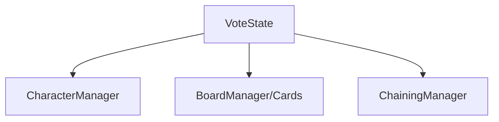

# 🛠️ Feature : Vote System

> [!IMPORTANT]
> **Rôle** : Permet l'élimination démocratique d'un joueur via un système de vote synchronisé par timer.

## 🎬 Déclencheur (Point d'entrée)
- Serveur : Transition vers le `GameState` `VoteState`.
- Client : Clic sur `Card.voteCanvas` (Bouton de vote).

## 📦 Composants Clés
| Composant | Responsabilité |
| :--- | :--- |
| `VoteState` | Gère la machine à états du vote (Timer, décompte, désignation du gagnant). |
| `VoteCanvas` | UI cliente affichée sur les cartes des joueurs pour soumettre un vote. |
| `ChainingManager` | Reçoit le résultat pour application de l'élimination physique. |

## 💾 Données & État
- **Entrées** : `OnPlayerVotedServer` (RPC).
- **Persistance** : Dictionnaire `votesForPlayer` sur le serveur. Timer répliqué par RPC.
- **Sorties** : `mostVotedPlayer` ID (ID joueur ou SKIP_ID).

## 🕸️ Couplage & Dépendances

## ⚠️ Points d'Attention & Risques
- [ ] **Réflection (Performance)** : Utilisation de `GetMethod` par réflexion dans le `GameManager` pour invoquer la logique de vote (perte de Type Safety).
- [ ] **Déconnexion** : Risque de blocage si un joueur votant se déconnecte pendant la phase sans gestion d'exception explicite dans le timer.

---
> [!SUCCESS]
> **Critères de Validation** : À la fin du timer, le joueur ayant la majorité des voix est éliminé (ou le vote est sauté si majorité de votes blancs).
