# Benchmark interfaces HTML/CSS (transposables UITK) : résultats

> **Notation de l'orchestrateur, sur captures et code, à l'aveugle.** Les notes ont été figées dans `NOTES-AVEUGLES.md` (horodatage UTC en fin de fichier) avant la lecture du mapping. Ces notes restent **subjectives** : un seul évaluateur, qui tourne sur le même modèle que candidat-55 (voir « Biais »).

## Protocole

- **Candidats.** `candidat-48` (`claude-opus-4-8`) et `candidat-55` (`claude-opus-5-5`). Chacun avait trois écrans à produire, avec un énoncé identique : H1 écran de vote, H2 révélation de rôle, H3 lobby.
- **Contraintes communes.**
  - Un seul `index.html` autonome, sans ressource externe ; le JavaScript est facultatif et réservé aux données factices.
  - Un CSS transposable en USS, avec la liste des écarts dans `RAPPORT.md`.
  - Un rendu lisible en 1920×1080 et en 1280×720.
- **Anonymisation.**
  - Les candidats ont écrit dans des dossiers neutres.
  - Un script a ensuite réparti les sorties sous les lettres **X/Y**, avec un **tirage indépendant par écran**, et effacé les chemins qui trahissaient l'auteur.
  - Il a pris les captures avec Chromium headless, en relevant les requêtes externes, les erreurs JS et les débordements.
  - Les candidats devaient répondre uniquement « Terminé ».
- **Grille visuelle, sur 10.** Lisibilité 2, direction artistique 2, complétude 2, mise en page dans les deux formats 2, transposabilité UITK 2.
- **Bonus code, sur 5.** Structure HTML 1, organisation du CSS (tokens, nommage) 1, séparation des données 1, composants réutilisables 1, propreté 1.

## Mapping révélé

| Écran | X | Y |
|---|---|---|
| H1 Vote | candidat-55 | candidat-48 |
| H2 Révélation de rôle | candidat-48 | candidat-55 |
| H3 Lobby | candidat-55 | candidat-48 |

## Scores

| Écran | candidat-48 visuel /10 | candidat-48 code /5 | candidat-55 visuel /10 | candidat-55 code /5 |
|---|---|---|---|---|
| H1 Vote | 8,5 | 3,75 | 9,5 | 4,25 |
| H2 Révélation de rôle | 7,0 | 4,25 | 9,5 | 4,5 |
| H3 Lobby | 8,0 | 4,5 | 9,0 | 4,0 |
| **Total** | **23,5 / 30** | **12,5 / 15** | **28,0 / 30** | **12,75 / 15** |
| **Total général** | **36,0 / 45** | | **40,75 / 45** | |

L'écart se joue sur le **visuel** (+4,5 pour candidat-55). Sur le **code**, les deux candidats sont à égalité (12,5 contre 12,75).

## Détail par écran

### H1 : Vote

| | candidat-48 (Y) | candidat-55 (X) |
|---|---|---|
| 1920×1080 | 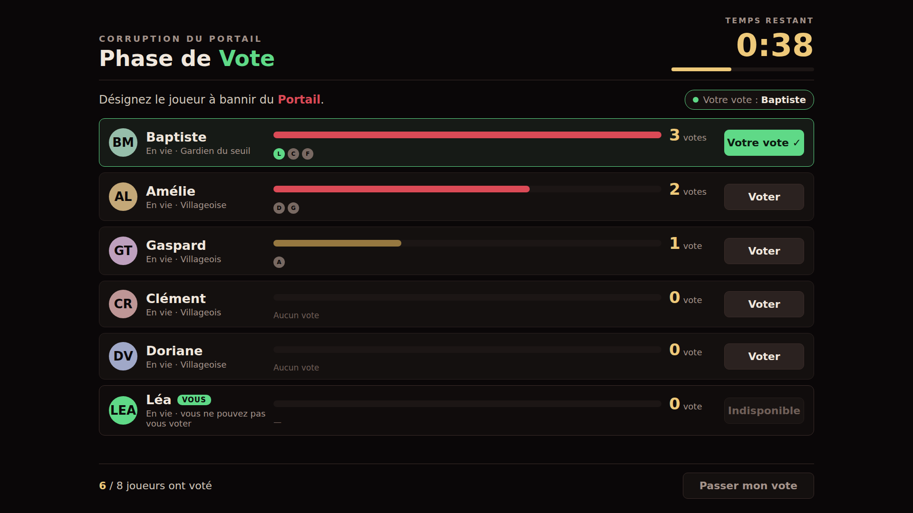 | 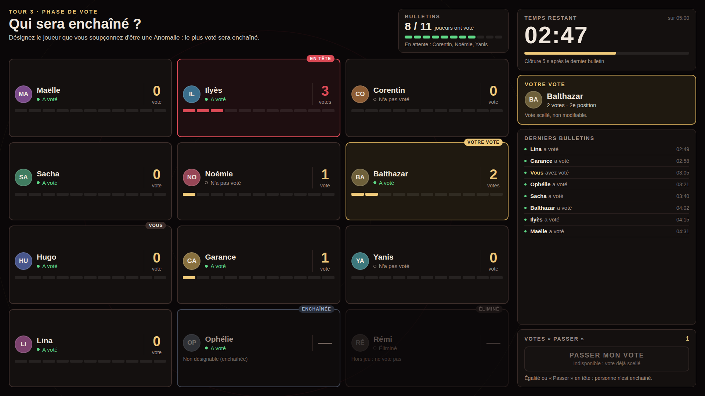 |
| 1280×720 | 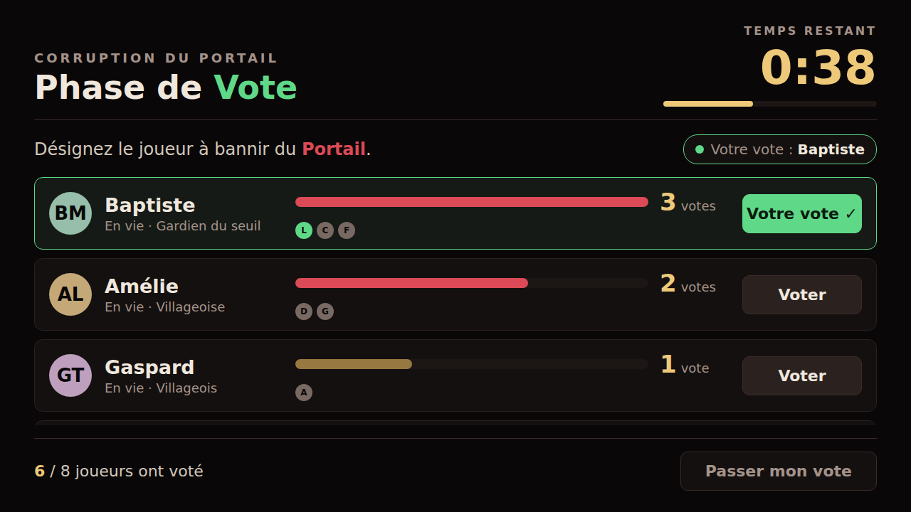 | 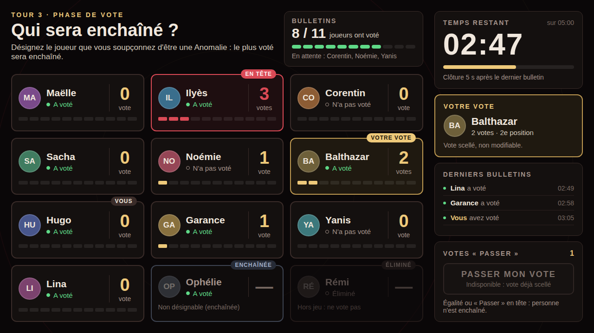 |

**candidat-48 : 8,5 + 3,75**
- **Points forts :** une liste claire, des barres de vote avec les initiales des votants, un bouton « Voter » par ligne et un compte à rebours bien visible.
- **Direction artistique (1/2) :** l'écran affiche les rôles des autres joueurs (« Villageois », « Gardien du seuil »), ce qui contredit un jeu à rôles cachés. « Villageois » n'est d'ailleurs pas un rôle du jeu. Le vocabulaire (« bannir ») s'éloigne de la mécanique réelle, où le joueur est enchaîné.
- **Mise en page (1,5/2) :** en 1280×720, seuls 3 joueurs sont visibles sans défilement, et l'avatar « LEA » déborde de son cercle.
- **Code :**
  - huit `style="…"` inline, pour les largeurs des barres ;
  - aucun token CSS (`var()`) ;
  - données écrites en dur dans le HTML.

**candidat-55 : 9,5 + 4,25**
- **Fidélité au jeu :** « Qui sera enchaîné ? », statuts enchaîné / éliminé et « Clôture 5 s après le dernier bulletin », qui correspond au comportement réel de `VoteState`.
- **Contenu :** compteur de votes « passer », journal des derniers bulletins, encadré « Votre vote ».
- **Mise en page :** parfaite dans les deux formats.
- **Lisibilité (1,5/2) :** les cartes sont hautes et en partie vides en 1920×1080, et l'écran est dense.
- **Code :** 73 usages de tokens `var(--…)`. En revanche, le HTML est très verbeux (385 attributs `class`), les 12 cartes étant écrites à la main.

### H2 : Révélation de rôle

| | candidat-48 (X) | candidat-55 (Y) |
|---|---|---|
| 1920×1080 | 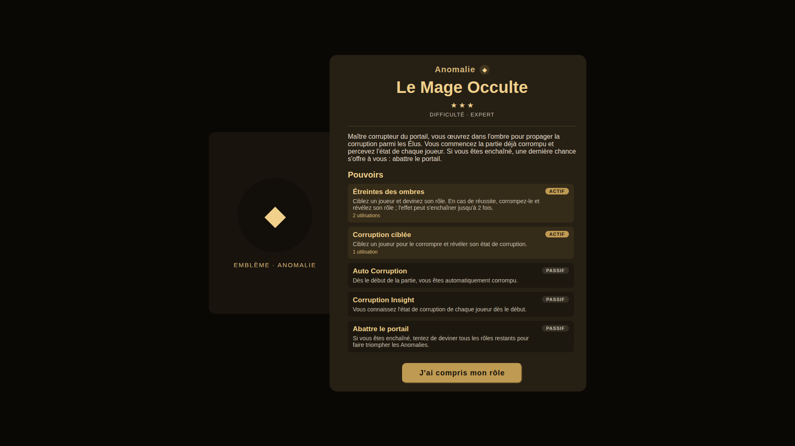 | 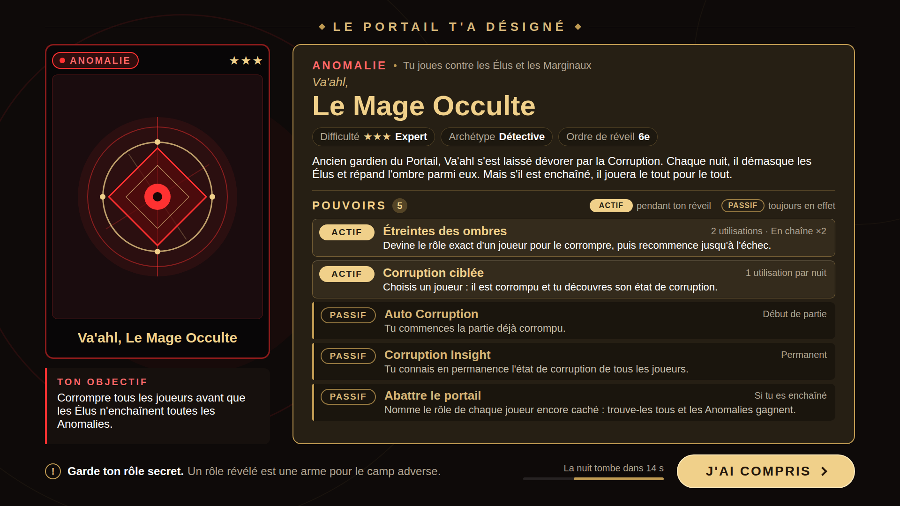 |
| 1280×720 | 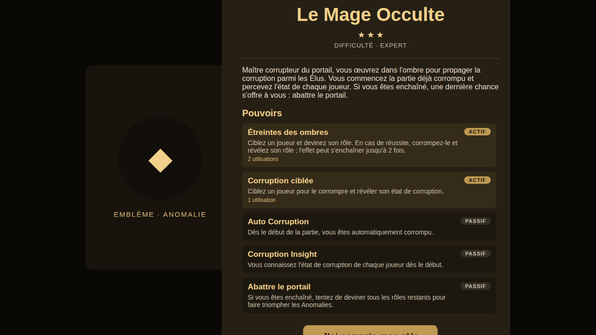 |  |

**candidat-48 : 7,0 + 4,25**
- **Complétude (2/2) :** contenu complet, avec des données réelles tirées du GDD.
- **Mise en page (0,5/2) :** **débordement en 1280×720** (768 px de haut pour 720 visibles). Le titre et le bouton « J'ai compris » sont coupés. En 1920×1080, le panneau emblème, à moitié recouvert par la carte principale, donne une composition bancale.
- **Direction artistique (1/2) :** rendu plat et emblème minimal.
- **Code :** les données sont injectées en JavaScript, ce qui les sépare bien de la mise en page, mais les couleurs sont écrites en dur, sans tokens.

**candidat-55 : 9,5 + 4,5**
- **Rendu :** le meilleur écran du benchmark. Emblème travaillé, objectif du rôle, légende actif / passif, badges, rappel « Garde ton rôle secret », compte à rebours avant la nuit et appel à l'action bien visible.
- **Mise en page :** identique dans les deux formats.
- **Transposabilité (1,5/2) :** `@media` avec `scale`, et `100vw` / `100vh`. Le choix est cependant justifié et documenté honnêtement : le candidat a lu le `PanelSettings` du projet (Scale With Screen Size, référence 1920×1080) et émule ce comportement. En USS, c'est le `PanelSettings` qui s'en charge.
- **Code :** 75 usages de tokens.

### H3 : Lobby

| | candidat-48 (Y) | candidat-55 (X) |
|---|---|---|
| 1920×1080 | 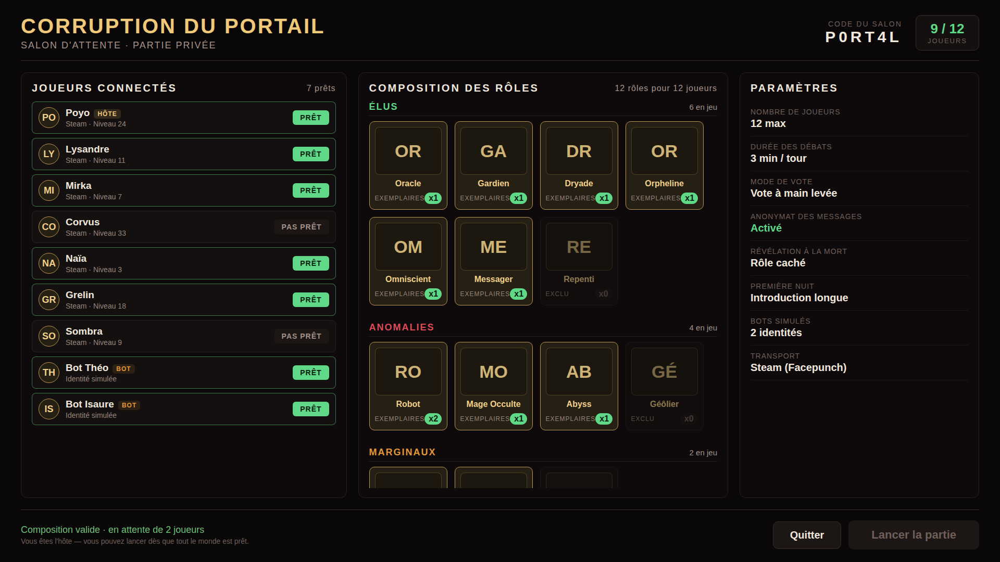 | 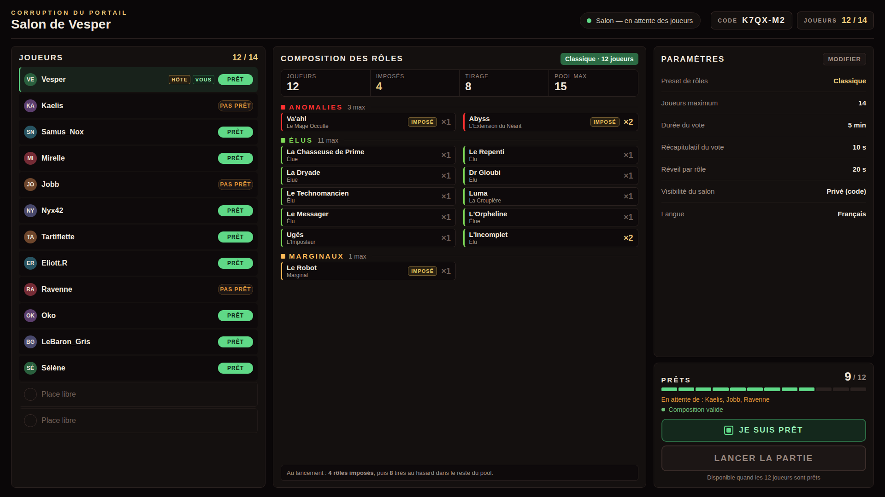 |
| 1280×720 | 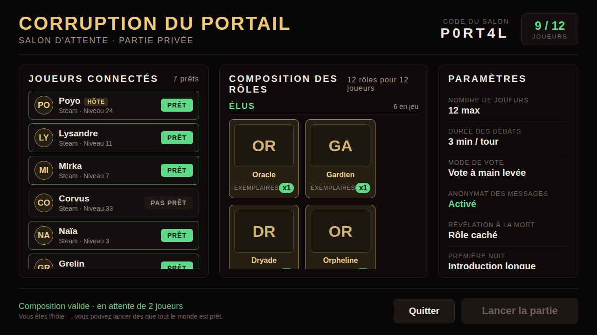 | 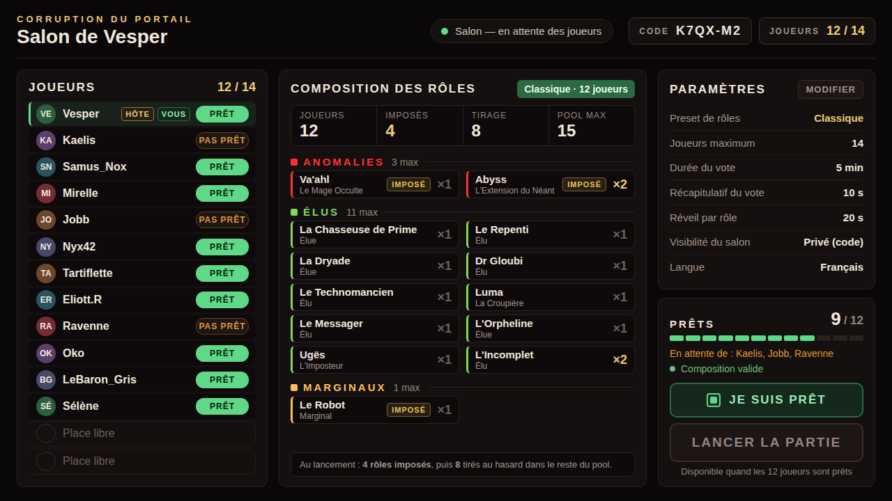 |

**candidat-48 : 8,0 + 4,5**
- **Direction artistique (2/2) :** titre fort et grille de cartes de rôle. L'hôte s'appelle « Poyo », un clin d'œil à l'équipe.
- **Complétude (1,5/2) :** la section Marginaux est coupée dans le panneau de composition, même en 1920×1080.
- **Lisibilité (1,5/2) :** le libellé « EXEMPLAIRES » touche le badge « x1 ».
- **Mise en page (1/2) :** en 1280×720, tout défile, seules 4 cartes sont visibles et le titre passe à la ligne.
- **Code (4,5) :** les cartes sont générées en JavaScript à partir d'un tableau de données ; c'est la meilleure séparation données / vue du benchmark.

**candidat-55 : 9,0 + 4,0**
- **Fidélité au jeu :** « Imposés / Tirage / Pool max » reproduit exactement le modèle max/forced de `GameSettingsManager`. Les états prêt / pas prêt / hôte / vous sont affichés, avec une jauge de joueurs prêts et les deux boutons, « Je suis prêt » et « Lancer ».
- **Mise en page :** tout tient dans les deux formats.
- **Lisibilité (1,5/2) et direction artistique (1,5/2) :** textes petits, écran dense et sobre.
- **Code :** 118 couleurs `rgba()` écrites en dur, sans aucun token, et données en dur dans le HTML.

## Incidents

| Type | candidat-48 | candidat-55 |
|---|---|---|
| Écritures hors du dossier de sortie | Aucune | **H2 : onze fichiers écrits dans le dossier scratchpad de l'orchestrateur** (`dec.py`, `elu.html`, `marg.html`, `t.html`, captures `.png`, `nodechrome`, `venv`), en violation de la règle 4 |
| Auto-vérification visuelle | Aucune trace | **H2 : a fait le rendu de sa page avec Chromium pour se vérifier** ; les traces sont moins nettes sur H1 et H3 |
| Consigne de réponse « Terminé » seule | **Non respectée** sur H1 et H2 : les comptes rendus décrivaient le design | Respectée |
| Requêtes externes / erreurs JS | Aucune | Aucune |

## Biais et limites

- **Fuite partielle d'anonymat.** Les comptes rendus de candidat-48 sur H1 (« aucun JS », palette de `variables.uss`) et sur H2 (« Le Mage Occulte », « aucun gradient / box-shadow ») sont arrivés avant la notation. Comme les deux candidats ont choisi le Mage Occulte pour H2, le rendu plat de X/H2 pouvait laisser deviner son auteur. La note la plus exposée est donc **H2 de candidat-48 (7,0)**. Sa pénalité principale repose cependant sur un fait objectif : le débordement en 1280×720, détecté par le script.
- **Biais d'auto-préférence.** L'orchestrateur tourne sur le même modèle que candidat-55. Une contre-notation humaine sur les captures, qui prend 5 minutes, est la seule façon de l'écarter.
- **Bonus code superficiel.** Il repose sur une analyse statique et des indicateurs (tokens, couleurs en dur, JS, `style` inline, profondeur de l'arbre), pas sur une lecture ligne à ligne.
- **Transposabilité non vérifiée dans Unity.** Personne n'a converti les pages en UXML/USS. Le « transposable » est déclaratif, contrôlé par une recherche des fonctionnalités CSS sans équivalent USS. Certaines règles restent **à vérifier**, par exemple la prise en charge exacte de `font-weight` ou de `letter-spacing` en USS 6000.5.
- **Échantillon limité.** Une seule exécution par écran.

## Fichiers

- `X/` et `Y/` : `index.html`, `RAPPORT.md`, `capture-1920x1080.png`, `capture-1280x720.png` et `render-log.txt`, pour chaque écran.
- `NOTES-AVEUGLES.md` : les notes figées avant la révélation du mapping.
- Mapping : `.model-test/mapping-html.txt`.
- Dossier placé à la racine du dépôt, hors d'`Assets/`, pour que Unity n'importe ni les pages ni les PNG.
